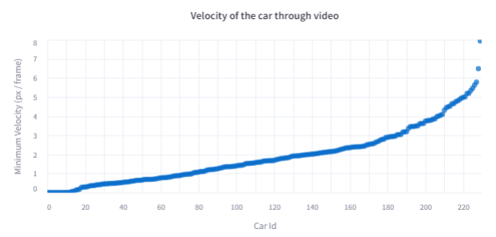

# Stop Sign Analysis
This project analyzes videos of cars approaching a stop sign to see how well drivers actually stop. This project does not include the videos themselves, so it can be viewed as an example for this type of image recognition project.

## Conclusions
The main conclusion from this project was that stop sign compliance in a residential neighborhood is MUCH lower than expected. Even taking into account rolling stops, we only saw about 10% of cars come to a complete stop. This was so unexpected that I actually viewed many videos to convince myself that this wasn't a data processing issue.

# Running the project
This project runs completely in Python. However, the resources to run the large YOLOv8 model on this many videos can be taxing for a CPU, so getting CUDA and the appropriate GPU drivers can make a significant difference (days vs hours) in processing a large quantity of videos.

## Setup
1. Download the yolov8x.pt file from the table here and place it in this folder: https://docs.ultralytics.com/models/yolov8/#performance-metrics
2. Install the python libraries for `ultralytics`, `streamlit`, `pandas`, `altair`
3. Set up CUDA and tensorflow for your machine (not required, but provides a big speed boost if you have a GPU)

## Preprocessing
1. Place your videos in the `input` folder.
2. Run `python process.py` to generate json files in the `data` folder for each video.

## Viewing Results
To view the results, run `python -m streamlit run app.py` from within the project folder. This should start your browser and process the JSON data files into a chart.